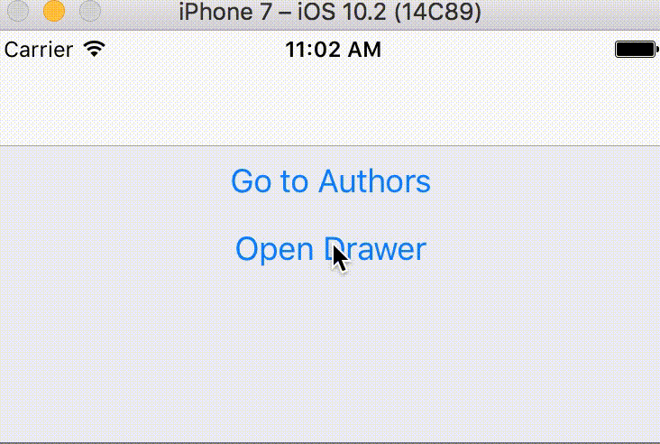

Our app will contain a navigation drawer with two menu options, the first option would be for the BookView, containing the list of books. The other option would be for the AuthorView, containing the list of authors. For navigation between the different views, we'll use [React Navigation](https://reactnavigation.org/docs/en/hello-react-navigation.html). So let's install it:

```
npm install --save react-navigation
```

## createStackNavigator

Our ReactNative app will contain two modules, an Author module allowing the users to browse list of authors, and a Books module, containing the list of books. Author and Book module will be implemented using the StackNavigator from [React Navigation](https://reactnavigation.org). Think of StackNavigator as the history stack of web browser. When the user clicks on a link, the URL is pushed to the browser history stack, and removed from the top of the history stack when the user presses the back button. 

```js
export const BookStack = createStackNavigator({
  Books: {
    screen: BooksScreen,
  },
})

export const AuthorStack = createStackNavigator({
  Authors: {
    screen: AuthorsScreen,
  },
})
```

For BooksScreen and AuthorsScreen, we'll simply add two stateless [react components](https://reactjs.org/docs/components-and-props.html) for now, with some buttons to test our screen navigation and drawer functionality: 

```js
const BooksScreen = ({ navigation }) => (
  <View>
    <Button
      onPress={() => navigation.navigate('Authors')}
      title="Go to Authors"
    />
    <Button onPress={() => navigation.openDrawer()} title="Open Drawer" />
  </View>
)

const AuthorsScreen = ({ navigation }) => (
  <Button
    onPress={() => navigation.navigate('Books')}
    title="Go back to Books"
  />
)
```
`navigation.openDrawer()` will trigger the drawer to open. `navigation.navigate()` allows the app to navigate to different screens.  

In our application, we'll add a Drawer which will maintain the menu for our Author and Book modules. The drawer will be implemented using React Navigation's [createDrawerNavigator](https://reactnavigation.org/docs/en/drawer-based-navigation.html). The first menu in the drawer will be for the Author module, and the second for the Book module. Author and Book Stack Navigators will both be inside the main DrawerStack. Here's the code for the drawer implementation:

```js
const App = createDrawerNavigator({
  Books: {
    screen: BookStack,
  },
  Authors: {
    screen: AuthorStack,
  },
})
```

Here's a diff of our latest changes:
xxxx

In the file App.js, we've made the following changes:

1. We renamed the default export to App 
2. We added two stateless components for our screens, BooksScreen and AuthorsScreen.
3. We added the StackNavigator from [React Navigation](https://reactnavigation.org) to implement navigation for our app.
4. We used [createDrawerNavigator()](https://reactnavigation.org/docs/en/drawer-based-navigation.html) from react-navigation to implement the Drawer Navigation. This renders the Drawer content, along with the menu options for Books and Authors.

And after making the above changes, here's what our UI looks like when we click on the "Open Drawer" button and navigate between screens.

  

## Directory Structure

It's important to think about your application and how you'll structure of your files and resources in the beginning of the project. While there could be several ways of structuring your application code, I prefer co-locating files and tests using a feature-based architecture. Co-locating files related to a particular feature or module has several benefits.

Let's create a src directory, where we'll keep all our source files, and inside it, create two directories, one for the book view, named "book", and the other for the author view, named "author". 

Create index.js files within each of the two directories we just added. These files will export the components for each of our views. Move the code from App.js for the BookView and AuthorView components into these files, and import them instead.


It's important to note that refactoring should be a big part of the development workflow. We should continuously refactor our code to prepare ourselves for future changes and challenges. This has a big impact on productivity and change management in the long run. 

Our app should still work as it was before the refactor. Here's a file diff of our recent changes:
github.com/qaiser110/react-native-mobx-starter/commit/99fbd537de1cefc3723b79fe25394063abe62a3c

Each of the screen will have a title, which means that we'd be duplicating the same code along with the styles. To keep our code DRY, let's move the title to a separate file "src/components/Title.js", and reuse it where needed. We'll also move the main views into a new parent directory "src/views" to keep them separate from other components.

Here's a file diff of our recent changes:
github.com/qaiser110/react-native-mobx-starter/commit/578f9bbcd2e946ca52e579c160aa17b0917947d8

## Tab Navigation

The business requirement for our app is to have three tabs in the books view, to show all books by default, and additional tabs to show filtered books for the fiction and non-fiction books. Let's use the [createBottomTabNavigator](https://reactnavigation.org/docs/en/tab-based-navigation.html) from react-navigation to implement the Tab Navigation.

```js
import { createBottomTabNavigator } from 'react-navigation'

import { AllBooksTab, FictionBooksTab, NonfictionBooksTab } from ' components/book-type-tabs'

export default createBottomTabNavigator({
  'All Books': AllBooksTab,
  Fiction: FictionBooksTab,
  Nonfiction: NonfictionBooksTab,
})
```

We should also add a title on every screen to identify the currently selected screen. Let's create a separate directory `src/components` for all the common components, and create a file for our `Title` component inside this new directory.

```js
// src/components/Title.js
import React from 'react'
import { StyleSheet, Text } from 'react-native'

const styles = StyleSheet.create({
  header: {
    textAlign: 'center',
    padding: 20,
    marginTop: 20,
    fontSize: 20,
    color: '#fff',
    backgroundColor: '#434343',
  },
})

export default ({ text }) => <Text style={styles.header}>{text}</Text>
```

As you'll notice, I've also added styles to the `<Text>` component, importing both `StyleSheet` and `Text` from `react-native`.

We'll add the `Title` to each view component, providing the title `text` in the props. Also, since Authors view just contains a list of authors, we don't need a StackNavigator for it, so we'll change it to a plain React component. Here's what our `src/views/author/index.js` file looks like now:

```js
import React from 'react'
import { View, Button } from 'react-native'

import Title from '../../components/Title'

export default ({ navigation }) => (
  <View>
    <Title text="Authors List" />
    <Button onPress={() => navigation.openDrawer()} title="Open Drawer" />
    <Button onPress={() => navigation.navigate('Books')} title="Go to Books" />
  </View>
)
```

Now, when we open the Books menu from the drawer, we're able to switch tabs by clicking on the tabs at the bottom.

With those changes we have our apps navigations all done. 

## Authors List using react-native-elements

yarn add react-native-elements

We'll add in some Authors

github.com/qaiser110/react-native-mobx-starter/commit/7e5ef8c6dd12c64b9721a4e17050ed9c60c835c6

## Stack Navigation

We'll need a top bar on Author View and Book View, and a menu icon to open the drawer. So for both the views, instead of returning a ReactNative View, we'll return a StackNavigator instead.

## All Books View and books data

We'll need data
a view for displaying a list of all books

I've also removed all the content from the book tabs, since we'll be adding the actual content there shortly.
